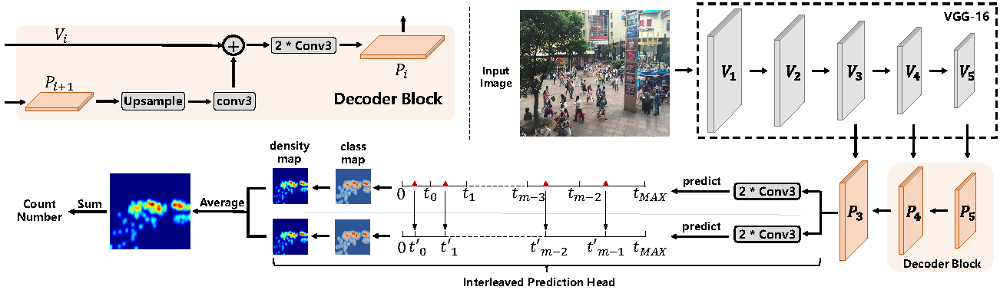
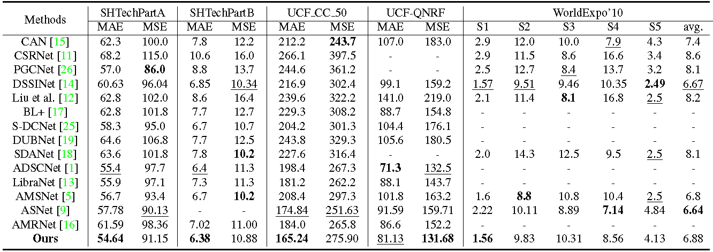

# UEPNet (ICCV2021 Poster Presentation)

This repository contains codes for the official implementation in PyTorch of **UEPNet** as described in [Uniformity in Heterogeneity: Diving Deep into Count Interval Partition for Crowd Counting](https://arxiv.org/abs/2107.12619).
 
The codes is tested with PyTorch 1.5.0. It may not run with other versions.

## Visualized results for UEPNet
   

## The network
The network structure of the proposed UEPNet. It consists of a simple encoderdecoder network for feature extraction and an Interleaved Prediction Head to classify each patch into certain interval.

   

## Comparison with state-of-the-art methods
The UEPNet achieved state-of-the-art performance on several challenging datasets with various densities, although using a quite simple network structure.

   

## Installation
* Clone this repo into a directory named UEPNet_ROOT
* Organize your datasets as required
* Install Python dependencies. We use python 3.6.5 and pytorch 1.5.0
```
pip install -r requirements.txt
```

## Organize the counting dataset
We use a list file to collect all the images and their ground truth annotations in a counting dataset. When your dataset is organized as recommended in the following, the format of this list file is defined as:
```
train/scene01/img01.jpg train/scene01/img01.txt
train/scene01/img02.jpg train/scene01/img02.txt
...
train/scene02/img01.jpg train/scene02/img01.txt
```

### Dataset structures:
```
DATA_ROOT/
        |->train/
        |    |->scene01/
        |    |->scene02/
        |    |->...
        |->test/
        |    |->scene01/
        |    |->scene02/
        |    |->...
        |->train.list
        |->test.list
```
DATA_ROOT is your path containing the counting datasets.

### Annotations format
For the annotations of each image, we use a single txt file which contains one annotation per line. Note that indexing for pixel values starts at 0. The expected format of each line is:
```
x1 y1
x2 y2
...
```

## Testing

A trained model (with an MAE of **54.64**) on SHTechPartA is available at "./ckpt", run the following commands to conduct an evaluation:

```
CUDA_VISIBLE_DEVICES=0 python3 test.py \
    --train_lists $DATA_ROOT/train.list \
    --test_lists $DATA_ROOT/test.list \
    --dataset_mode shtechparta \
    --checkpoints_dir ./ckpt/ \
    --dataroot $DATA_ROOT \
    --model uep \
    --phase test \
    --vgg_post_pool \
    --gpu_ids 0
```

## Acknowledgements

- Part of codes are borrowed from the [pytorch-CycleGAN-and-pix2pix](https://github.com/junyanz/pytorch-CycleGAN-and-pix2pix).

## Citing UEPNet

If you find UEPNet is useful in your project, please consider citing us:

```BibTeX
@inproceedings{wang2021uniformity,
  title={Uniformity in Heterogeneity: Diving Deep into Count Interval Partition for Crowd Counting},
  author={Wang, Changan and Song, Qingyu and Zhang, Boshen and Wang, Yabiao and Tai, Ying and Hu, Xuyi and Wang, Chengjie and Li, Jilin and Ma, Jiayi and Wu, Yang},
  journal={Proceedings of the IEEE/CVF International Conference on Computer Vision},
  year={2021}
}
```

## Related works from Tencent Youtu Lab
- [AAAI2021] To Choose or to Fuse? Scale Selection for Crowd Counting. ([paper link](https://ojs.aaai.org/index.php/AAAI/article/view/16360) & [codes](https://github.com/TencentYoutuResearch/CrowdCounting-SASNet))
- [ICCV2021] Rethinking Counting and Localization in Crowds: A Purely Point-Based Framework. ([paper link](https://arxiv.org/abs/2107.12746) & [codes](https://github.com/TencentYoutuResearch/CrowdCounting-P2PNet))